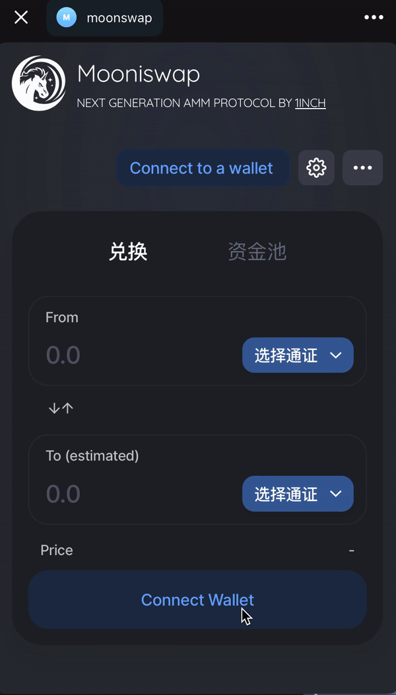

###  Mooniswap Support for UxuyConnect: Thought Process and Implementation Steps

### Overall Thought Process
 Based on the overall architecture of Mooniswap, we only need to add a UxuyTgConnector and implement the abstract methods of Web3-react. This will enable Mooniswap to support the Telegram mini-program wallet UXUY, making the Mooniswap experience smoother on Telegram.


##### 1 Mooniswap Code Structure Directory Analysis
``` 
src
    |- assets
        |- images           // // Directory for storing logo icons, add uxuywallet.svg
    
    |- connectors           // Directory for wallet connectors based on @ReactWeb3
        |- index.ts

    |- constants            // Directory for Swap application constant configurations
        |- index.ts         // Configuration information for supported wallet connections is here

    |-components
        |-AccountDetails    // Directory for user account display interface
        |-index.tsx         // User wallet connection and account display, as well as action triggers
 ```
 


 
##### 2、Add Base Installation Library
 ``` shell
 yarn add @uxuycom/web3-tg-sdk
 ```

##### 3、Create Connector
Add UxuyConnector.ts in src/connector.ts

 ``` typescript
import { AbstractConnector } from '@web3-react/abstract-connector'
import { ethers } from 'ethers'
import { WalletTgSdk } from '@uxuycom/web3-tg-sdk'

export class UxuyTgConnector extends AbstractConnector {
  private ethereum: any
  private provider: ethers.providers.Web3Provider | null = null

  constructor(args?: any) {
    super(args)
    const { ethereum } = new WalletTgSdk() //Initialize UXUY SDK
    this.ethereum = ethereum
    this.setupListeners() // Register event listeners
  }

  // Activate wallet connection
  public async activate(): Promise<any> {
    try {
      // Request account connection
      const accounts = await this.ethereum.request({ method: 'eth_requestAccounts' })
      const account = accounts[0] || null

      // Get current chain ID
      const chainId = await this.getChainId()

      // Wrap as ethers.js Web3Provider
      this.provider = new ethers.providers.Web3Provider(this.ethereum)

      return { provider: this.provider, chainId, account }
    } catch (error) {
      throw new Error(`active error`)
    }
  }

  // Get chain ID
  public async getChainId(): Promise<number | string> {
    try {
      const chainId = await this.ethereum.request({ method: 'eth_chainId' })
      return parseInt(chainId, 16)
    } catch (error) {
      throw new Error(`获取链ID失败: ${error.message}`)
    }
  }

  // Get current account
  public async getAccount(): Promise<string | null> {
    try {
      const accounts = await this.ethereum.request({ method: 'eth_accounts' })
      return accounts.length > 0 ? accounts[0] : null
    } catch (error) {
      throw new Error(`获取账户失败: ${error.message}`)
    }
  }

  // Implement getProvider method
  public async getProvider(): Promise<ethers.providers.Web3Provider | null> {
    return this.provider
  }

  // Disconnect
  public async deactivate() {
    try {
      this.provider = null
      this.emitDeactivate()
      console.log('Wallet deactivated')
    } catch (error) {
      console.error('Error during wallet deactivation', error)
    }
  }

  // Listen for event: account change
  private handleAccountsChanged = (accounts: string[]) => {
    this.emitUpdate({ account: accounts.length === 0 ? null : accounts[0] })
  }

  // Listen for event: chain ID change
  private handleChainChanged = (chainId: string) => {
    this.emitUpdate({ chainId: parseInt(chainId, 16) })
  }

   // Register event listeners
  private setupListeners() {
    this.ethereum.on('accountsChanged', this.handleAccountsChanged)
    this.ethereum.on('chainChanged', this.handleChainChanged)
  }
}
 ```
 
##### 4、 Import Connector Globally
In the src/connector/index.ts file, import uxuyConnect and declare it at the beginning.

```typescript
// Add  uxuyConnect at the beginning
import { fortmatic, injected, portis, walletconnect, uxuyConnect,walletlink } from '../connectors'
```


``` typescript
// Add the UXUY_CONNECT object property in const SUPPORTED_WALLETS.
export const SUPPORTED_WALLETS =
  process.env.REACT_APP_CHAIN_ID !== '1'
    ? TESTNET_CAPABLE_WALLETS
    : {
        ...TESTNET_CAPABLE_WALLETS,
        ...{
          UXUY_CONNECT: {
            connector: uxuyConnect,
            name: 'UxuyConnect',
            iconName: 'uxuyConnectIcon.svg',
            description: 'Connect to UxuyConnect..',
            href: null,
            color: '#4196FC',
            mobile: true
          },
          WALLET_CONNECT: {
            connector: walletconnect,
            name: 'WalletConnect',
            iconName: 'walletConnectIcon.svg',
            description: 'Connect to Trust Wallet, Rainbow Wallet and more...',
            href: null,
            color: '#4196FC',
            mobile: true
          },
          WALLET_LINK: {
            connector: walletlink,
            name: 'Coinbase Wallet',
            iconName: 'coinbaseWalletIcon.svg',
            description: 'Use Coinbase Wallet app on mobile device',
            href: null,
            color: '#315CF5'
          },
          COINBASE_LINK: {
            name: 'Open in Coinbase Wallet',
            iconName: 'coinbaseWalletIcon.svg',
            description: 'Open in Coinbase Wallet app.',
            href: 'https://go.cb-w.com/dFdHIRRZS8',
            color: '#315CF5',
            mobile: true,
            mobileOnly: true
          },
          FORTMATIC: {
            connector: fortmatic,
            name: 'Fortmatic',
            iconName: 'fortmaticIcon.png',
            description: 'Login using Fortmatic hosted wallet',
            href: null,
            color: '#6748FF',
            mobile: true
          },
          Portis: {
            connector: portis,
            name: 'Portis',
            iconName: 'portisIcon.png',
            description: 'Login using Portis hosted wallet',
            href: null,
            color: '#4A6C9B',
            mobile: true
          }
        }
      }
```

##### 5、Add Wallet Logo to the Corresponding Directory

```
src\asset\images\walletConnectIcon.svg

```
##### 6、Modify User Account Interface Logic for Uxuy Wallet
```
    |-components
        |-AccountDetails    // Directory for user account display interface
        |-index.tsx     
```

Open  file 'index.tsx' and import uxuyConnect at the top.
```typescript
import { injected, walletconnect, walletlink, fortmatic, portis, uxuyConnect } from '../../connectors'
```

Add operation judgment for the account, as some wallets have connect and disconnect constructors, while uxuyConnect uses active and deactive to connect and disconnect the wallet.
```typescript

//line 316
                  {connector !== injected && connector !== walletlink && (
                    <WalletAction
                      style={{ fontSize: '.825rem', fontWeight: 400, marginRight: '8px' }}
                      onClick={() => {
                        if (connector === uxuyConnect) {
                          connector.deactivate();  // UxuyConnector uses deactivate()
                        }else{
                          (connector as any).close()
                        }
                        
                      }}
                    >
                      Disconnect
                    </WalletAction>
                  )}

```

##### 7 Handle Some Details, Modify Account Status Wallet Logo Display
Display the account with the wallet connection and the corresponding icon logo. Also add this in this file.

``` typescript
//  Find the getStatusIcon() method, add 

// Add this
import UxuyConnectIcon from '../../assets/images/uxuyConnectIcon.svg' 

//...

function getStatusIcon() {
    if (connector === injected) {
      return (
        <IconWrapper size={16}>
          <Identicon />
        </IconWrapper>
      )
    } else if (connector === uxuyConnect) {
      return (
        <IconWrapper size={16}>
          
        </IconWrapper>
      )
    } else if(connector === walletconnect) {
      return (
        <IconWrapper size={16}>
          
        </IconWrapper>
      )
    } else if (connector === walletlink) {
      return (
        <IconWrapper size={16}>
          
        </IconWrapper>
      )
    } else if (connector === fortmatic) {
      return (
        <IconWrapper size={16}>
          
        </IconWrapper>
      )
    } else if (connector === portis) {
      return (
        <>
          <IconWrapper size={16}>
            
            <MainWalletAction
              onClick={() => {
                portis.portis.showPortis()
              }}
            >
              Show Portis
            </MainWalletAction>
          </IconWrapper>
        </>
      )
    }
  }
  
  //...

```


##### 8、Complete Modifications, Package and Deploy to See the Result

tips:If the TypeScript version in the project is lower than 4.5, you need to remove the type from '@uxuycom/web3-tg-sdk/dist/types/src/provider/TronLinkProvider/TronLinkProvider.d.ts' and 'EthereumProvider.d.ts'. This is a feature of TypeScript 4.5 and above, otherwise, it will report a type error.

``` typescript
// tChange type Account to Account
import { Account, PROVIDER_ALLIANCE, initOptions } from "../../types";

```

After checking and modifying everything,

Development and debugging:
``` shell
yarn start  

```
Production deployment:
```
yarn build
```



##### 9 Summary
We look forward to @Web3React adding support for UxuyWallet, so that swap can be directly deployed to the Telegram mini-app, and the user's trading experience in the mini-app will be smoother.